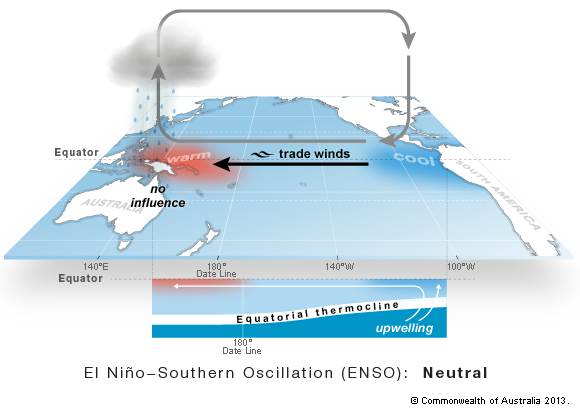
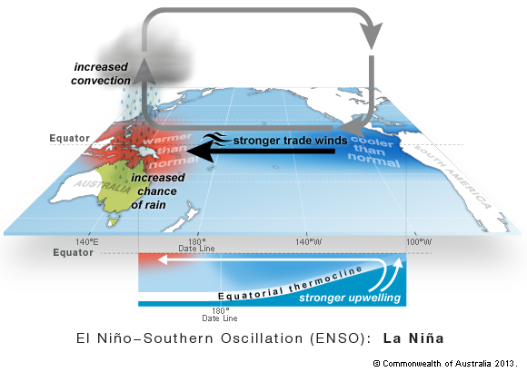
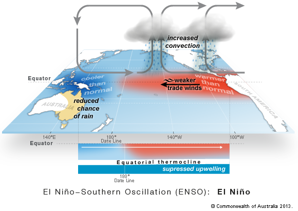

## Table of contents:

#### 1. Introduction

- Table of contents
- Background information
- References

#### 2. Heat Map of the Great Barrier Reef

- Heat map visualisation of a chosen temperature variable (DHW, SST, or SSTA) spatially across the Great Barrier Reef from 1987-2024

#### 3. ENSO vs temperature

- Graphical visualisation of a chosen temperature variable (DHW, SST or SSTA) every month for a specified year and the corresponding ENSO phase for that year

#### 4. Predictions

- Graphical comparison of model predictions with actual data, to demonstrate validity and areas of strength in the model 

---

## Background Information

### Introduction of the Great Barrier Reef

The Great Barrier Reef (GBR) is the world’s largest coral reef system, a marine ecosystem that stretches over 2,300 kilometers along the northeastern coast of Australia. Covering approximately 344,400 square kilometers in the Coral Sea, it consists of ~2,500 individual reefs and over 900 islands. The reef supports an extraordinary variety of marine organisms, serving as a vital spawning, nursery, breeding, and feeding ground for thousands of species, including fish, marine mammals, sea turtles, and invertebrates.

This highly bio-diverse reef system plays a crucial role in supporting economic industries such as tourism and fishing, and helps to protect coasts. However, the GBR is increasingly threatened by multiple environmental stressors, primarily climate change-induced coral bleaching, rising sea surface temperatures (SSTs), extreme weather events, outbreaks of crown-of-thorns starfish (Acanthaster spp.), declining coral calcification rates, and pollution-driven declines in water quality.

Scientific studies have recorded worsening coral bleaching events, highlighting increasing frequency and severity over recent decades. The first observed mass coral bleaching events occurred in the 1980s, but ever since then recurrent bleaching episodes have devastated significant portions of the reef. One of the most severe recorded events took place during the austral summer of 2015–2016, with record-breaking SSTs leading to an estimated 29% bleaching-related mortality of all shallow-water corals in the GBR, with the northern sections suffering the most significant losses. Additional bleaching episodes followed in 2017, 2020, 2022, and most recently in 2024, raising concerns over the long-term resilience of the reef.

Understanding the impact of accumulated thermal stress on the GBR and its relationship with the El Niño Southern Oscillation is essential for developing more effective conservation strategies. By examining how different sections of the reef, inner, mid, and outer shelves, respond to Degree Heating Weeks, the GBRMPA can identify patterns that help predict future bleaching events. This can help guide the implementation of targeted protection measures, ensuring that vulnerable areas of the GBR receive the necessary attention and help. 

### What is ENSO?

El Niño Southern Oscillation (ENSO) refers to the natural climate oscillation between El Nino and La Nina phases. This oscillation is measured using the Southern Oscillation Index (SOI), which is calculated by measuring the differences in barometric air pressure between Darwin and Tahiti. Prolonged positive SOI values indicate a La Nina phase and negative values indicate an El Nino phase. All other periods are classified as a neutral phase or ‘normal’ conditions. 

During a ‘neutral’ ENSO phase, trade winds push warm waters west across the pacific ocean, assisting with the upwelling of cold water in the east pacific ocean (figure 1). The warm waters in the west pacific creates overcast conditions characterised by rainfall to the north of Australia (figure 1). 

*Figure 1. Neutral ENSO phase, Bureau of Meteorology*

A shift to a La Nina phase occurs when trade winds across the pacific ocean are stronger than normal, increasing the temperature and extent of warm waters in the western pacific, while increasing the upwelling of cool water in the east (figure 2). This creates wetter conditions characterised by strong rainfall across eastern and northern Australia (figure 2).

*Figure 2. La Nina ENSO phase, Bureau of Meteorology*

An El Nino phase occurs when trade winds are weaker than normal, resulting in cooler waters in the western pacific and warmer waters in the east due to suppressed cold water upwelling (figure 3). This leads to drier and hotter conditions on the east and northern coasts of Australia (figure 3).  

*Figure 3. El Nino ENSO phase, Bureau of Meteorology*

The temperature variables used:

**Sea Surface Temperature (SST)**
Sea Surface Temperature (SST) is a satellite measure of the sea surface ocean temperature at nighttime, calibrated to reflect temperatures at 0.2 m depth. Nighttime temperatures are used instead of daytime to minimise the impact of solar heating on the sea surface during the day, and to prevent solar glare contamination. Nighttime SST is also known to be more vertically uniform than daytime SST, making nighttime temperatures a more reliable measurement of heat stress.

**Sea Surface Temperature Anomaly (SSTA)**
Sea Surface Temperature Anomaly (SSTA) refers to how much the current SST differs from the long term average. For example, a positive SSTA indicates the SST is warmer than the long term average and a negative value indicates it is cooler. Small SSTA values (-0.2 to +0.2 °C) are not considered to be meaningful deviations from the average as this range of temperature fluctuation is expected due to climatological factors. 

**Degree Heating Weeks (DHW)**
Degree Heating Weeks (DHW) is a measure of the intensity and duration of thermal stress. The unit of measurement of DHW is degrees celsius-weeks (°C-week). 1 °C-week is achieved when the SST is 1 °C above the average maximum SST for that location for a duration of one week. For example, if SST is 2 °C above the average maximum for one week, the DHW would be 2 °C-weeks. In addition, if the SST is 1 °C above the average maximum for two weeks, the DHW would also be 2 °C-weeks. DHWs of 4 °C-weeks or greater causes significant coral bleaching, and DHWs over 8 °C-weeks causes significant coral mortality. It is a more valuable measurement of thermal stress as it indicates cumulative temperature anomalies. 

### Why is this important?

**DHW as an indicator of coral bleaching:**

Given DHW are a measure of thermal stress, with 4 °C-weeks indicative of significant coral bleaching and 8 °C-weeks indicative of coral mortality, DHW offers an appropriate measure and predictor of coral bleaching events. Studies investigating the effectiveness of DHW as an index for mass bleaching have found that mass bleaching events correlate significantly with DHW values of 8 °C-weeks or greater. Additionally, a significant positive relationship between DHW and projected probability of coral bleaching was found, validating the use of DHW as an indicator and threshold value for coral bleaching on the GBR.

Major bleaching, in response to thermal stress, was observed in 1980, 1983, 1987, 1994, 1998, 2002 and in the southern GBR, in 2006. Thermal stress has also been linked to outbreaks of coral disease on the GBR. These ecological responses to warming oceans are likely to increase in frequency in the future and it is essential to understand the linkages between global and regional climate variations.

### Why is understanding ENSO important?

ENSO variation is one of the most consequential year-to-year fluctuations of the climate system, with significant impacts across the climate system. Specifically, it is an important driver of SST in the tropical Pacific, including our area of focus, the GBR. 

Historically, mass bleaching events have occurred in years of severe El Nino phases, due to increased SST. However, areas across the reef have been impacted in different ways in different years. It is important to understand that the GBR is not a monolith, and that differing areas of the reef will respond differently under different stressors. Understanding the relationship between ENSO and degree heating weeks may allow an identification of areas that are more at risk in specific phases, or show which sections are more susceptible to changed SST. 

ENSO temperature and rainfall variability has increased since the 1960s, with increased amplitudes leading to more frequent strong El Nino and La Nina events. This is expected to increase across all future emission scenarios, leading to increases in SST anomalies. Thus, understanding the impacts of ENSO across regions of the GBR are helpful in the context of increasingly variable future projections. 

## References

Bureau of Meteorology. (2023). El Niño Southern Oscillation (ENSO). Bureau of Meteorology; Australian Government. http://www.bom.gov.au/climate/about/?bookmark=enso

Cai, W., Ng, B., Geng, T., Jia, F., Wu, L., Wang, G., Liu, Y., Gan, B., Yang, K., Santoso, A., Lin, X., Li, Z., Liu, Y., Yang, Y., Jin, F.-F., Collins, M., & McPhaden, M. J. (2023). Anthropogenic impacts on twentieth-century ENSO variability changes. Nature Reviews Earth & Environment, 4, 1–12. https://doi.org/10.1038/s43017-023-00427-8

Cai, W., Ng, B., Wang, G., Santoso, A., Wu, L., & Yang, K. (2022). Increased ENSO sea surface temperature variability under four IPCC emission scenarios. Nature Climate Change, 12. https://doi.org/10.1038/s41558-022-01282-z

Kayanne, H. (2016). Validation of degree heating weeks as a coral bleaching index in the northwestern Pacific. Coral Reefs, 36(1), 63–70. https://doi.org/10.1007/s00338-016-1524-y

NOAA Coral Reef Watch. (n.d.). NOAA Coral Reef Watch 5km Methodology Page. Coralreefwatch.noaa.gov; National Oceanic and Atmospheric Administration. https://coralreefwatch.noaa.gov/product/5km/methodology.php#dhw

Redondo-Rodriguez, A., Weeks, S. J., Berkelmans, R., Hoegh-Guldberg, O., & Lough, J. M. (2012). Climate variability of the Great Barrier Reef in relation to the tropical Pacific and El Niño-Southern Oscillation. Marine and Freshwater Research, 63(1), 34. https://doi.org/10.1071/mf11151